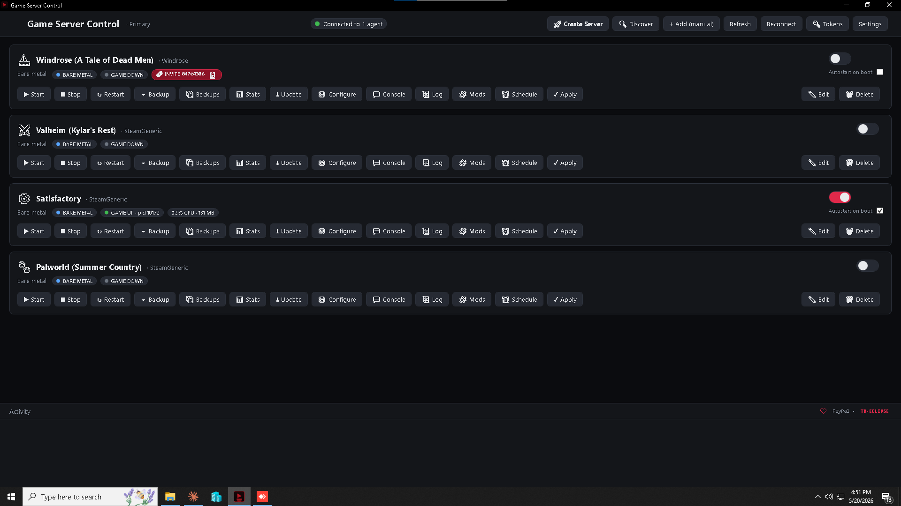
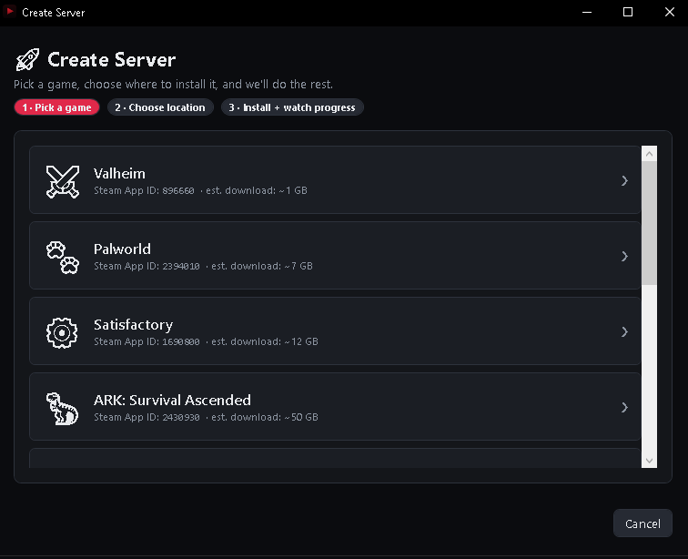
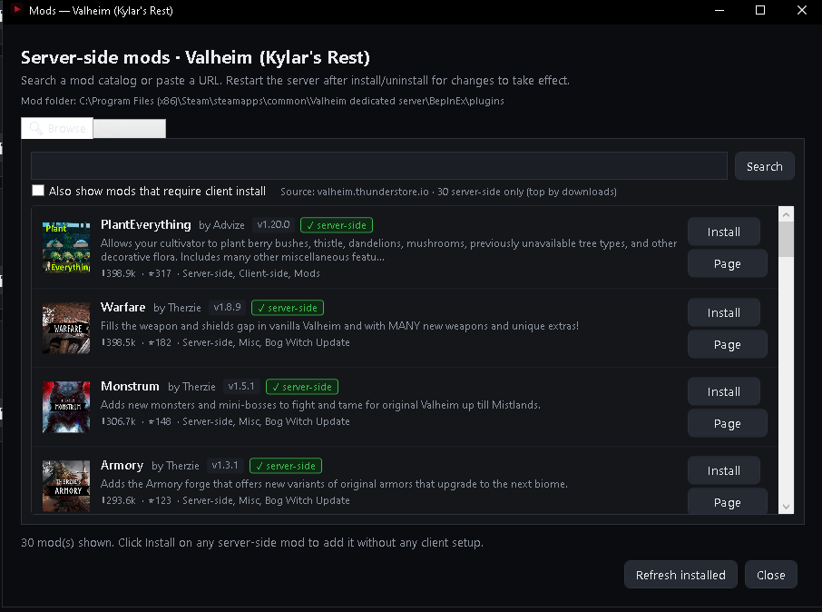
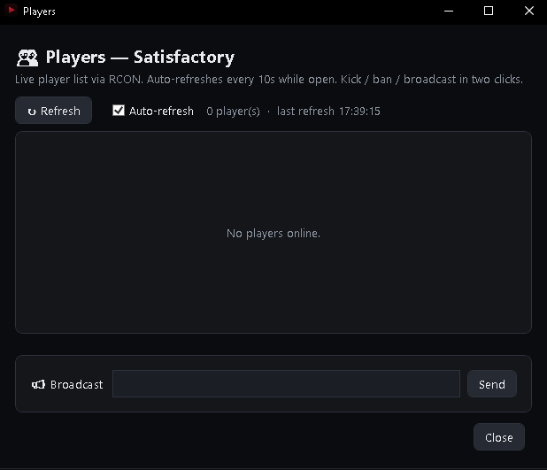
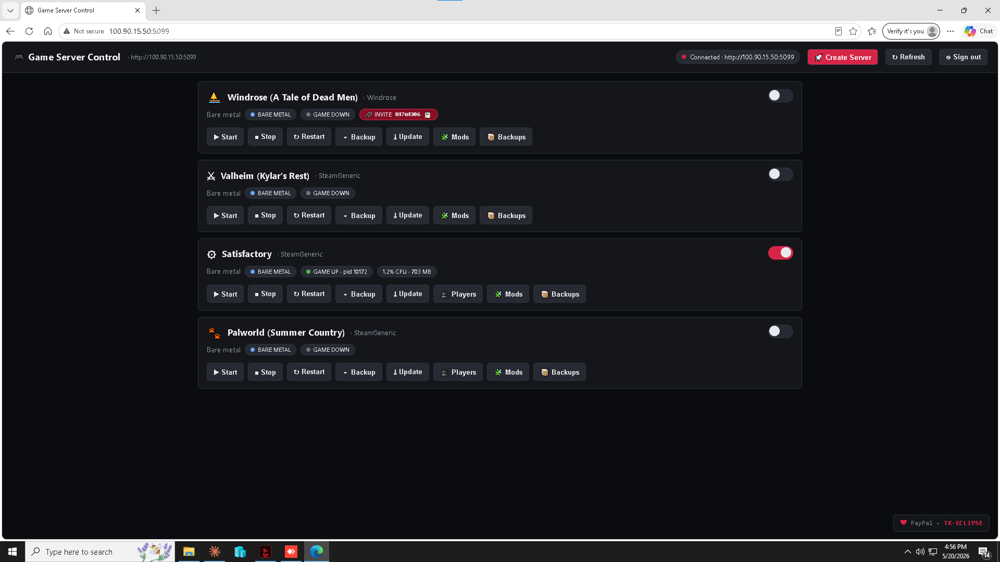

# GameServerControl

I host game servers for me and a few friends. After getting fed up with SSH and steamcmd for the hundredth time, I built this.

It's a service you install on the machine your game servers live on. You point a browser at it (or the Windows desktop client) and you get a dashboard for everything: install new servers, start/stop them, browse mods, manage RCON, take backups, schedule maintenance, see when something's crashed.

Right now it handles Valheim, Satisfactory, Palworld, ARK Survival Ascended, ARK Survival Evolved, Rust, V Rising, Conan Exiles, Squad, Soulmask, 7 Days to Die, Terraria, Don't Starve Together, Project Zomboid, Minecraft Java, and Windrose. Adding more is a couple files of work, see the bottom of this doc.

The agent itself runs on Windows, Linux, and macOS. The desktop client is Windows-only (it's WPF, sorry). Everyone else uses the browser UI which works on phones too.

MIT licensed. Meant to live behind Tailscale or a LAN. There's HTTPS with a self-signed cert and a random API token, but don't expose the port to the public internet expecting that to be enough.

## Install

Re-run the same command later to upgrade. The scripts grab .NET 8 if you don't have it, fetch the latest release, set up the right service flavor, and keep your config files across upgrades.

Windows, admin PowerShell:

    iwr https://raw.githubusercontent.com/tyrus2244/GameServerControl/main/deploy/windows/install.ps1 | iex

If you only want the desktop client (no admin, no service):

    iwr https://raw.githubusercontent.com/tyrus2244/GameServerControl/main/deploy/windows/install-client.ps1 | iex

Linux:

    curl -fsSL https://raw.githubusercontent.com/tyrus2244/GameServerControl/main/deploy/linux/install-from-release.sh | sudo bash

macOS:

    curl -fsSL https://raw.githubusercontent.com/tyrus2244/GameServerControl/main/deploy/macos/install-from-release.sh | bash

The agent prints a generated API token to the log on first boot. Paste it into the client or the browser UI when prompted.

## Screenshots

## How it works

The Create Server button is the part I'm most happy with. You pick a game from a list, give it a path to install to, and the agent handles the rest. If steamcmd isn't on the box it downloads it. Then it runs `+login anonymous +force_install_dir <path> +app_update <appid> validate` and parses the progress percentage out of steamcmd's output so the bar actually moves. When it finishes the server is registered with default args, save dirs, and exe path, ready to start.

If you've already got servers set up the old-fashioned way, the Discover button scans Steam libraries (via `libraryfolders.vdf` and `appmanifest_*.acf`) plus a handful of common paths like `C:\GameServers`, `~/gameservers`, `/srv/gameservers`, and `~/Library/Application Support/Steam` on Mac. Anything it finds that isn't already registered shows up with an Add button. There's also a plain manual Add for stuff Discover doesn't catch.

The mod browser has different backends per game because every game's mod scene is different. Valheim pulls from Thunderstore. Satisfactory uses ficsit.app's GraphQL API. ARK does Workshop installs through steamcmd, you paste a workshop URL or ID. Palworld has a curated list because the Palworld mod ecosystem mostly lives on GitHub Releases instead of a single marketplace. Windrose has no community marketplace yet so the Mods tab just says so. By default the browser filters to server-side mods so your players don't have to install anything themselves. Thunderstore dependencies resolve automatically, and there's a Check Updates button that compares installed versions against the marketplace.

Backups for bare-metal installs are zip archives of the save directories. For VMs it uses Hyper-V checkpoints. Restoring takes a safety snapshot of the current state first so a bad restore is recoverable. Scheduled maintenance has three buttons: daily restart, weekly steamcmd update, hourly backup. On Windows that drives Task Scheduler. On Linux you do the same thing yourself with a systemd timer (recipe in the wiki). On macOS you use a LaunchAgent with a calendar interval.

RCON is the feature I use most. The Players window shows who's online, refreshes every 10 seconds, has kick/ban/broadcast buttons. Source-engine RCON for Palworld, with a pluggable interface for other dialects. There's a separate Console window if you want to type raw RCON commands.

If a server goes from Running to NotRunning without you clicking Stop, the agent counts that as a crash and posts to a Discord webhook if you've configured one for that server.

You can connect to multiple agents from the same dashboard. Settings holds a list of agent URLs and tokens. Servers from every agent merge into one list, each card shows which host owns it, and actions route to the right agent automatically.

Tokens live in `tokens.json` next to `servers.json` on the agent. Two roles, Admin and ReadOnly. Anything that mutates state needs Admin. The Tokens window in the client manages them.

## Docker

There's a Dockerfile and a docker-compose example under `deploy/docker/`. The image is the agent only (no desktop client, you wouldn't run WPF in a container anyway). It auto-downloads steamcmd into the container on first install, so the host doesn't need it.

To run with compose:

    cd deploy/docker
    docker compose up -d

Three bind mounts get exposed by the compose file:

    ./data/config        agent config (appsettings.json, servers.json, tokens.json, SteamCMD cache)
    ./data/gameservers   where Create Server installs land. Point this at a big disk.
    ./data/backups       zip backups

Adjust the paths to wherever you want them on your host. Port 5099 is forwarded by default.

The container image isn't published to a registry yet, you build it locally. If you want it on Docker Hub or ghcr let me know.

## Stuff that isn't there yet

VM hosting is Windows-only because Hyper-V is Windows-only. Linux and Mac users just use bare-metal mode, which is what most people want anyway.

No native client on Mac or Linux. The browser UI covers it. Open to a contributor doing an Avalonia or MAUI port if anyone really wants one.

The Discord webhook is fire-and-forget. If Discord is down when a crash happens the event is lost, not retried.

The in-app update banner notifies you when there's a new release but doesn't self-update. Auto-replacing a running service is a footgun I didn't want to ship.

ARK ASA is fifty gigabytes. Plan your disk before clicking Install.

## Platforms

Agent runs on Windows, Linux, and macOS (Apple Silicon and Intel). Desktop client only runs on Windows. Hyper-V mode only on Windows. Everything else is the same across all three.

On Windows the agent is a regular Windows service. On Linux it's a systemd unit. On macOS it's a per-user LaunchAgent in `~/Library/LaunchAgents`, which means you'll want auto-login enabled on a headless Mac so it starts on boot.

## Adding a game

Three pieces, in order of effort:

Add a row to `Shared/GamePresets.cs` with the Steam app ID, default exe path, args, save dirs. That's the minimum, gets you Install / Start / Stop / Backup. If the game has a settings file you want an editor for, implement `IGameConfig`. Easiest is to copy `Config/ValheimConfig.cs` or `Config/PalworldConfig.cs` and adapt. If the game uses a non-standard RCON dialect, implement `IGameRcon`.

PRs welcome.

## Repo layout

    src/
      GameServerControl.Shared/   DTOs, schemas, models
      GameServerControl.Agent/    The service. ASP.NET Core 8.
        Auth/                     Tokens, roles, audit log
        Config/                   Per-game config editors
        Discovery/                Steam library + appmanifest parsing
        Hyperv/                   VM control, PowerShell Direct, local process service
        Mods/                     Per-game mod managers
        Notifications/            Discord webhook, update checker
        Rcon/                     RCON glue
        Servers/                  Orchestrator, store, SteamCMD installer
        WebUi/                    Single HTML file
      GameServerControl.Client/   WPF desktop dashboard
    deploy/                       Install scripts + service definitions
    .github/workflows/            CI, tagged-release pipeline

## License

MIT. See LICENSE.

---

Maintained by TK-ECLIPSE. https://paypal.me/TKECLIPSE if you want to throw a few bucks.
